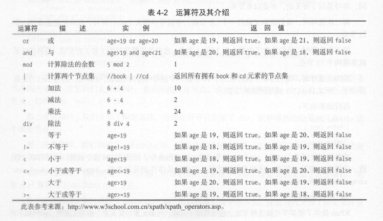

# 解析库的使用
> 获取html相关的节点

## XPath

> 相关的使用方法

```python
"""
Title:解析库的使用
Author:无医
Time:2024/8/2 
"""


# XPath -> XML Path Language
# //title[@lang='eng']  -> 选择所有名称为title 且属性值lang = eng 的节点

def fun_test():
    from lxml import etree
    import re

    text = '''
    <div>
    <ul>
    <li class="item-0" name="lq01"><a href="link1.html">first item</a>
    <li class="item-1"><a href="link2.html">second item</a>
    <li class="item-inactive"><a href="link3.html">third item</a>
    <li class="item-1"><a href="link4.html">fourth item</a>
    <li class="item-0"><a href="link5.html">fifth item</a>
    </ul>
    </div>
    '''
    html = etree.HTML(text)
    # 所有节点
    result = html.xpath('//*')
    # 所有li节点
    result_li = html.xpath('//li')
    print("所有节点", result)
    print("所有li节点", result_li)
    print("第一个li节点", result_li[0])

    # 子节点   /   //
    print("子节点：")
    result_zi = html.xpath('//li/a')  # //ul/a ul节点下的所有子孙a节点
    # / 用于获取直接子节点 //用于获取子孙节点
    print("获取li节点的直接a子节点", result_zi)

    # 父节点    ..
    print("父节点")
    result_fu = html.xpath('//a[@href="link4.html"]/../@class')
    result_fu_1 = html.xpath('//a[@href="link4.html"]/parent::*/@class')
    print(result_fu)
    print(result_fu_1)

    # 属性匹配
    print("属性匹配:")
    result_pipei = html.xpath('//li[@class="item-0"]')
    print(result_pipei)

    # 文本获取
    print("文本获取:")
    result_text = html.xpath('//li[@class="item-0"]/a/text()')
    result_text_ = html.xpath('//li[@class="item-0"]//text()')
    print(result_text)
    print(result_text_)

    # 属性获取 <->属性匹配 带有中括号[@href = "link1.html"]
    print("属性获取:")
    result_shuxing = html.xpath('//li/a/@href')
    print(result_shuxing)

    # 属性多值匹配 contain(属性名称 , 属性值)
    print("属性多值匹配:")
    text = '''
    <li class="li li-first name="item" ><a href="link.html">first item</a></li>
    '''
    html1 = etree.HTML(text)
    result1 = html1.xpath('//li[contains(@class,"li")]/a/text()')
    print(result1)

    # 多属性匹配
    print("多属性匹配")
    result2 = html1.xpath('//li[contains(@class,"li") and @name="item"]/a/text()')
    print(result2)

    # 按序选择
    print("按序选择:")
    result = html.xpath('//li[1]/a/text()')
    print(result)
    result = html.xpath('//li[last()]/a/text()')
    print(result)
    result = html.xpath('//li[position()<3]/a/text()')
    print(result)
    result = html.xpath('//li[last()-2]/a/text()')
    print(result)

    # 节点轴选择
    print("节点轴选择:")
    result = html.xpath('//li[1]/ancestor::*') # 获取所有祖先节点*
    print(result)
    result = html.xpath('//li[1]/ancestor::div') # 获取所有祖先div节点
    print(result)
    result = html.xpath('//li[1]/attribute::*') # 获取所有节点的属性值
    print(result)
    result = html.xpath('//li[1]/child::a[@href="link1.html"]') # 获取直接子节点
    print(result)
    result = html.xpath('//li[1]/descendant::*') # 获取所有子孙节点
    print(result)
    result = html.xpath('//li[1]/following::*[last()]') # 获取当前节点之后的所有节点
    print(result)
    result = html.xpath('//li[1]/following-sibling::*') # 获取当前节点之后的所有同级节点
    print(result)
    result_ = etree.tostring(html)
    print(result_.decode('utf-8'))


fun_test()

```

### XPath 运算符


## Beautiful Soup库的使用


```python
"""
Title:Beautiful Soup库的使用
Author:无医
Time:2024/8/3 
"""


def fun_test():
    from bs4 import BeautifulSoup
    soup = BeautifulSoup('<p>Hello</p>', 'lxml')
    print(soup.p.string)


# fun_test()

def fun_beautifulsoup_test():

    # 简单的使用
    html = """
    <html><head><title>The Dormouse's story</title></head>
    <body>
    <p class="title" name="dormouse"><b>TheDormouse's story</b></p>
    <p class="story">Once upon a time there were three little sisters; and their names were
    <a href="http://exapmle.com/elsie" class="sister" id="link1"><!-- Elsie --></a>
    <a href="http://exapmle.com/lacie" class="sister" id="link2">lacie</a> and
    <a href="http://exapmle.com/tillie" class="sister" id="link3">Tillie</a>;
    and they lived at the bottom of a well.</p>
    <p class="story">...</p>
    </body></html>"""  # 非完整的html 在初始化对象时完成补全
    from bs4 import BeautifulSoup
    soup = BeautifulSoup(html, 'lxml')  # 完成Beautifulsoup对象的初始化
    print(soup.prettify())  # 标准格式输出
    print(soup.title.string)

    # 选择元素
    print("选择元素")
    print(soup.title)
    print(type(soup.title))
    print(soup.title.string)
    print(soup.head)
    print(soup.p) # 匹配第一个

    # 提取信息
    print("提取信息:")
    print("节点名称", soup.title.name) # 获取节点名称
    print("节点属性", soup.p.attrs) # 返回属性字典 返回的结果可以为列表或字符串
    print("节点属性", soup.p.attrs['name'], soup.p['name'],)

    # 获取内容
    print("获取内容")
    print(soup.p.string)

    #嵌套选择
    print("嵌套选择")
    print(soup.head.title)
    print(type(soup.head.title))
    print(soup.head.title.string)

    # 关联选择
    html = """
        <html>
        <head>
        <title>The Dormouse's story</title>
        </head>
        <body>
        <p class="story">
            Once upon a time there were three little sisters; and their names were
            <a href="http://exapmle.com/elsie" class="sister" id="link1">
        <span>Elsie</span>
        </a>
        <a href="http://exapmle.com/lacie" class="sister" id="link2">Lacie</a>
        and
        <a href="http://exapmle.com/tillie" class="sister" id="link3">Tillie</a>;
        and they lived at the bottom of a well.
        </p>
        <p class="story">...</p>
        """
    soup = BeautifulSoup(html, 'lxml')
    print("关联选择")
    print(soup.p.contents) # 获取节点的直接子节点 ->列表形式
    print(soup.p.children)
    for i, child in enumerate(soup.p.children):
        print(i, child)
    print("获取所有子孙节点")
    print(soup.p.descendants)
    for i, child in enumerate(soup.p.descendants):
        print(i, child)

    # 父节点和祖先节点
    # print("父节点和祖先节点")
    # print(soup.a.parent) # 直接父节点
    # print("所有祖先节点")
    # print(type(soup.a.parents)) # 所有祖先节点
    # # print(list(enumerate(soup.a.parents)))
    html = """
    <html>
    <body>
    <p class="story">
                once upon a time there were three little sisters; and their names were
    <a href="http://example.com/elsie" class="sister" id="link1">
    <span>Elsie</span>
    </a>
                Hello
    <a href="http://example/com/lacie" class="sister" id="link2">Lacie</a>
    <a href="http://example/com/titlie" class="sister" id="link3">Tillie</a>
                and they lived at the bottom of a well.
    </p>
    """
    soup = BeautifulSoup(html, 'lxml')
    # 兄弟节点
    print("兄弟节点")
    print('Type ->Next Sibling', type(soup.a.next_sibling))
    print('Next Sibling', soup.a.next_sibling)
    print('提取信息', soup.a.next_sibling.string)
    print('Pre Sibling', soup.a.previous_sibling)
    print('Next Siblings', list(enumerate(soup.a.next_siblings)))
    print('Pre Siblings', list(enumerate(soup.a.previous_siblings)))


# fun_beautifulsoup_test()

# 方法选择器
def fun_find_all_test_():
    html="""
    <div class="panel">
    <div class="panel-heading">
    <h4>Hello</h4>
    </div>
    <div class="panel-body">
    <ul class="list" id="list-1" name="elements">
    <li class="element">Foo</li>
    <li class="element">Bar</li>
    <li class="element">Jay</li>
    </ul>
    <ul class="list list-small" id="list-2">
    <li class="element">Foo</li>
    <li class="element">Bar</li>
    </ul>
    </div>
    </div>
    """

    print("节点名查询")
    from bs4 import BeautifulSoup
    soup = BeautifulSoup(html, 'lxml')
    print(soup.find_all(name='ul'))
    print(type(soup.find_all(name='ul')[0]))
    for ul in soup.find_all(name='ul'):
        print(ul.find_all(name='li'))
        for li in ul.find_all(name='li'):
            print(li.string)
    print("属性查询")
    print(soup.find_all(attrs={'id': "list-1"}))
    print(soup.find_all(id='list-1'))
    print()
    print(soup.find_all(attrs={'name': "elements"}))
    print(soup.find_all(class_='element')) # 因为class在python中是关键字

    # print("匹配节点文本") # 传入形式 字符串 或者正则表达式对象
    # # import re
    # # html = """
    # # <div class="panel">
    # # <div class="panel-body">
    # # <a>Hello, this is a link</a>
    # # <a>Hello, this is a link, too</a>
    # # </div>
    # # </div>
    # # """
    # # soup = BeautifulSoup(html, 'lxml')
    # # print(soup.find_all(text=re.compile('link')))

    # find()方法  返回选择的第一个节点
    print("find方法:")
    print(soup.find(name='ul'))
    print(type(soup.find(name='ul')))
    print(soup.find(class_='list'))


# fun_find_all_test_()

# CSS选择器
def fun_css_test():
    from bs4 import BeautifulSoup
    html = """
    <div class="panel">
    <div class="panel-heading">
    <h4>Hello</h4>
    </div>
    <div class="panel-body">
    <ul class="list" id="list-1" name="elements">
    <li class="element">Foo</li>
    <li class="element">Bar</li>
    <li class="element">Jay</li>
    </ul>
    <ul class="list list-small" id="list-2">
    <li class="element">Foo</li>
    <li class="element">Bar</li>
    </ul>
    </div>
    </div>
    """
    soup = BeautifulSoup(html, 'lxml')

    print("CSS选择器:")
    print(soup.select('.panel .panel-heading'))
    print(soup.select('ul li'))
    print(soup.select('#list-2 .element'))
    print(type(soup.select('ul')[0]))

    # 嵌套选择
    print("嵌套选择")
    for ul in soup.select('ul'):
        print(ul.select('li'))

    print("获取属性")
    for ul in soup.select('ul'):
        print(ul['id'])
        print(ul.attrs['id'])

    # 获取文本
    print("获取文本")
    for li in soup.select('li'):
        print('Get Text:',li.get_text())
        print('String:',li.string)


fun_css_test()
```
>find_相关方法
>